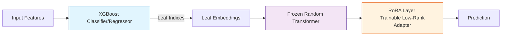
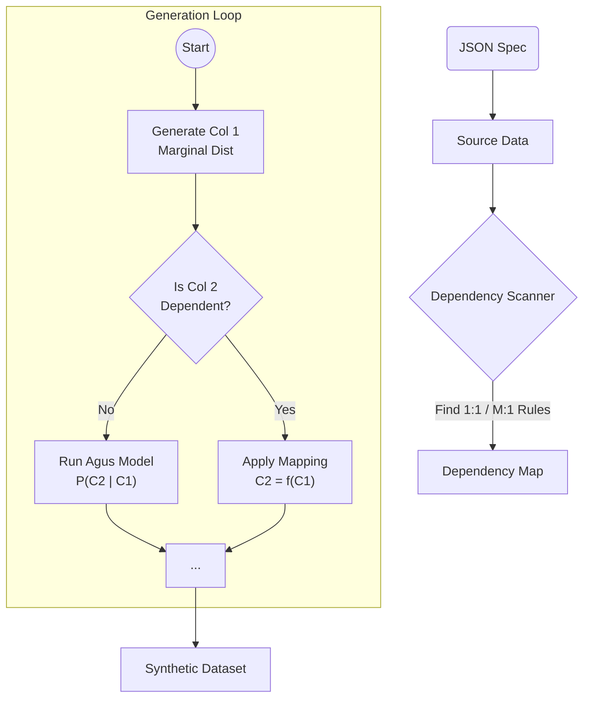

# Tabular AI: Generative Pipeline for CDISC Data

A robust, deep learning-based pipeline for generating high-fidelity synthetic tabular data. This project implements a hybrid approach combining **XGBoost**, **Random Transformers**, and **RoRA** (Rank-Optimal Reliability Adaptation) to model complex joint distributions while strictly preserving deterministic business rules (e.g., CDISC standards).

## Key Features

-   **Auto-Regressive Generative Chain**: Models the full joint distribution $P(X_1, \dots, X_n)$ by decomposing it into a sequence of conditional probabilities $P(X_i | X_{<i})$.
-   **Hybrid Architecture ("Agus Method")**: Uses XGBoost trees as a "Tokenizer" for tabular data, followed by a Random Transformer for high-dimensional projection, and RoRA for efficient fine-tuning.
-   **Specification-Driven**: Generate compliant source data from a simple JSON schema (`sdtm_spec.json`).
-   **Reverse Engineering**: Extract a JSON spec from an existing dataset to clone its structure and rules (`SpecExtractor`).
-   **Deterministic Integrity**: Heuristically detects and enforces functional dependencies (1:1 and M:1 mappings) such as `ARM` $\leftrightarrow$ `ARMCD` or `Zip` $\to$ `City`, ensuring consistency where probabilistic models might fail.

## Architecture

### 1. The Core Model (Agus Model)
For each column, we train a conditional model $P(Y | Features)$. The architecture leverages the strengths of Gradient Boosting (for handling tabular discontinuities) and Deep Learning (for representation).



### 2. The Generative Pipeline
The pipeline generates data sequentially. Crucially, it includes a **Dependency Scanner** that identifies columns that are strictly determined by previous columns, bypassing the model to ensure 100% rule compliance.



## Installation

```bash
git clone https://github.com/mrppdex/tabularAI.git
cd tabularAI
pip install pandas numpy xgboost torch scikit-learn faker tqdm
```

## Usage

### 1. Define Your Data (`sdtm_spec.json`)
Create a JSON file defining your schema. You can use standard types or derived mappings.

```json
{
    "rows": 1000,
    "columns": [
        {"name": "AGE", "type": "normal", "mean": 50, "std": 10},
        {"name": "ARM", "type": "categorical", "values": ["Placebo", "Drug 10mg"]},
        {
            "name": "ARMCD", 
            "type": "map", 
            "source": "ARM", 
            "mapping": {"Placebo": "PBO", "Drug 10mg": "DRG10"}
        }
    ]
}
```

### 2. Run the Demo
The advanced demo generates source data from the spec, trains the generative model, and outputs synthetic clones.

```bash
python demo_advanced.py
```

**Output:**
```
Scanning for deterministic dependencies...
  Found Dependency: ARM -> ARMCD
Training Generative Chain...
[1/3] AGE: Marginal Distribution
[2/3] ARM: Training classification model given ['AGE']
[3/3] ARMCD: SKIP (Dependent on ARM)
...
SUCCESS: Deterministic mapping preserved!
```

### 3. Reverse Engineering (Spec from Data)
You can extract a JSON spec from an existing CSV file. This allows you to clone the structure and rules of a private dataset without sharing the data itself.

```bash
python demo_reverse.py
```

This script:
1.  Loads `source_data.csv`.
2.  Infers types (Numeric, Categorical) and detects functional dependencies (Mappings).
3.  Saves the result to `inferred_spec.json`.
4.  Generates new synthetic data from this inferred spec to verify quality.

-   `agus_method.py`: PyTorch implementation of the XGB+Transformer+RoRA model.
-   `agus_gen.py`: The `AgusGenerator` class managing the auto-regressive chain and dependency logic.
-   `spec_generator.py`: Engine to create source data from JSON specs.
-   `sdtm_spec.json`: Configuration for CDISC-like data.
-   `demo_advanced.py`: End-to-end demonstration script.

## References

1.  **Agus Sudjianto**: Proposed the "XGBoost + Random Transformer + RoRA" approach for efficient tabular modeling. [LinkedIn Post / Feature Discussion]
2.  **CDISC SDTM**: Standard for submitting clinical trial data (Study Data Tabulation Model).
